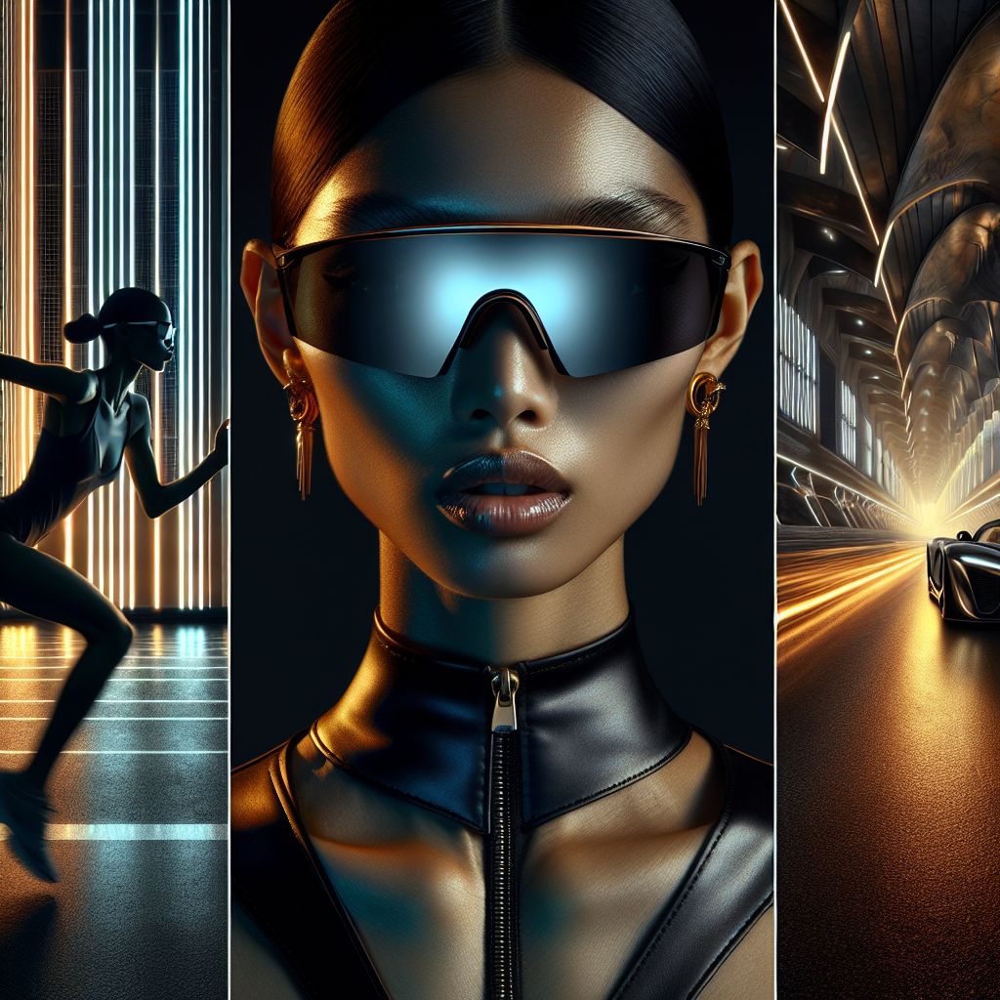

# 🕶️ Summer Sunglasses Campaign - Executive Summary

## 📊 Refined Trend Insights
Executive Summary: Summer 2026 Sunglasses Campaign

1. Market Trends  
- Futuristic Sport: Oversized, single-lens shield and wraparound frames that blend maximal coverage with a modern athletic edge.  
- Sculptural Glamour: Pronounced cat-eye and butterfly shapes that function as statement “jewelry,” offering bold angles and upswept silhouettes.  
- Modern Aviator: Timeless metal frames updated with slim profiles and gradient or tinted lenses for subtle personalization.

2. Curated Product Lineup  
- Sport (SG004)  
  • Aligns with the oversized shield trend via a seamless, single-lens design.  
  • Lightweight construction and rubber grips reinforce performance-driven comfort and style.  
- Mystique (SG003)  
  • Embodies sculptural glamour through its dramatic cat-eye shape and elegantly curved temples.  
  • Appeals to customers seeking high-impact, feminine statement eyewear.  
- Aviator (SG001)  
  • Delivers modern aviator appeal with a classic metal frame and optional gradient/tinted lenses.  
  • Proven bestseller with all-day comfort, reinforcing our core product heritage.

3. Strategic Rationale  
- Trend Coverage: The three styles span “sporty futurism,” “statement glamour,” and “timeless classic,” ensuring full-spectrum seasonal relevance.  
- Cross-Channel Storytelling: Launch Sport with athleisure visuals; Mystique through high-fashion editorials; Aviator in lifestyle and travel contexts.  
- Inventory-Driven Promotions: Stock levels (11 Sport, 3 Mystique, 23 Aviator) support tiered initiatives—limited Mystique drops to heighten urgency and broader availability for core Aviator styles.

By leveraging our best-selling silhouettes against Summer 2026’s defining eyewear trends, this campaign promises a cohesive message, broad consumer appeal, and optimized sell-through potential.

## 🎯 Campaign Visual

## ✍️ Campaign Quote
Race into Tomorrow with Futuristic Shields and Sculptural Glamour

## ✅ Why This Works
This phrase captures the campaign’s sporty-futurism (the neon-lit runner), the oversized shield trend (the sleek single-lens eyewear), and the statement sculptural elegance of the cat-eye aesthetic—echoing both the image’s high-tech visuals and Summer 2026’s top eyewear trends.
